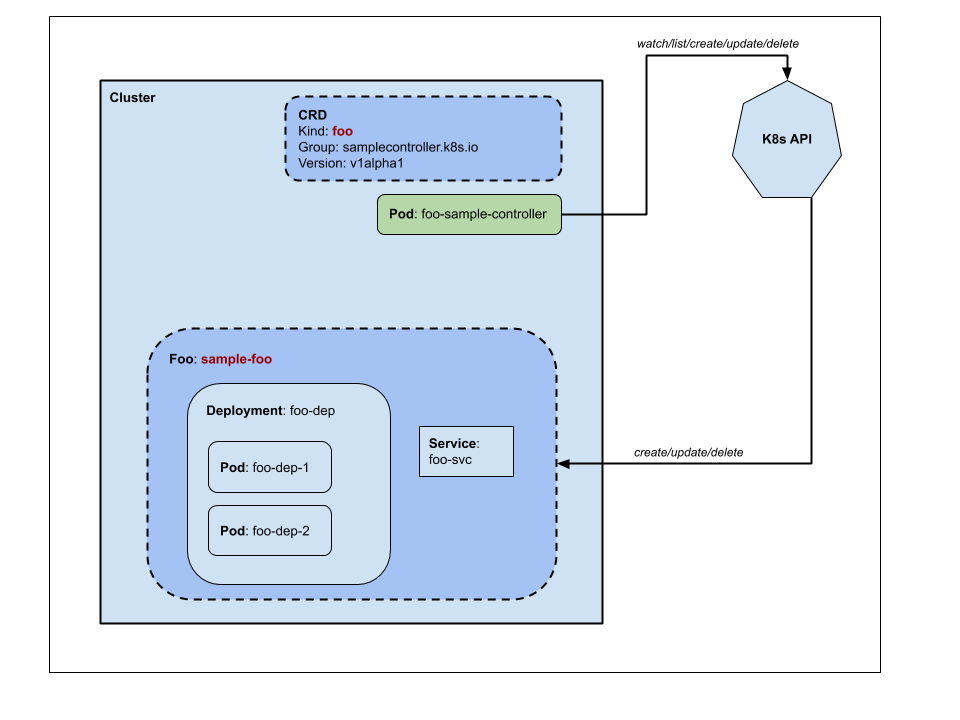

# sample-controller

Upstream: [simple controller example](https://github.com/kubernetes/sample-controller)

## Purpose

An example of how to build a kube-like controller with a single type.

- We are going to deploys a `example-controller` which implements the API resource `Foo` in K8s.
- API resource `Foo`, as well as its API group `samplecontroller.k8s.io`, are created as CustomResourceDefinition (CRD)
- When `Foo` is available in K8s, we can create/update/remove API objects from `Foo`, which subsequently creates functional `go-web` application.

## Architecture

- [sample-controller](https://docs.google.com/drawings/d/1ZAv0xfXusNso0dyluaeWvNjK-8h-kRfQda-eeY-5wsA/edit?usp=sharing)
  
- custom controller internals
  

## Deploy

- Install the controller

```sh
kustomize build . | kubectl apply -f -
```

- Create CRD

```sh
kubectl apply -f crd.yaml
```

- Create Foo

```sh
kubectl apply -f foo.yaml
```

## Teardown

```sh
kustomize build . | kubectl delete -f -
```
